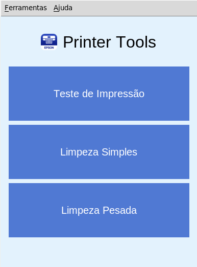

# PrinterTools

 

## O que é PrinterTools?

**PrinterTools** é uma ferramenta gráfica que usa o escputil para testar e fazer limpeza de cabeçote de impressão em impressoras Epson sistemas Linux e em especial o Raspberry Pi...

## Como ter o PrinterTools em seu computador?

Primeiramente certifique-se de ter o Python instalado em sua máquina: baixe o python [neste link](https://python.org)...

Agora clone este repositório em seu terminal ou prompt de comandos:
 
~~~

git clone https://github.com/elizeubarbosaabreu/PrinterTools && cd PrinterTools && python3 -m venv .venv && source .venv/bin/activate && pip install -r requeriments.txt

~~~
 
Para testar se tudo está bem, digite o comando abaixo no terminal ou prompt de comando:
 
~~~

python app.py

~~~

## Criando um menu, atalho para o software:

Se tudo funcionou bem, agora é hora de criar o link para que tudo funcione como software:

Crie um atalho apontado para o python da máquina virtual e para o app.py. No exemplo abaixo utilizei o *Alacarte* para criar o atalho:
 
~~~

/home/pi/.local/opt/PrinterTools/.venv/bin/python3 '/home/pi/.local/opt/PrinterTools/app.py'

~~~

A parte */home/pi/.local/opt/* é o diretório onde o projeto foi salvo e deve ser editado...

## Obrigado por usar nosso software!! Sinta-se a vontade para melhorá-lo, mas não esqueça de deixar uma estrelinha para nós...
